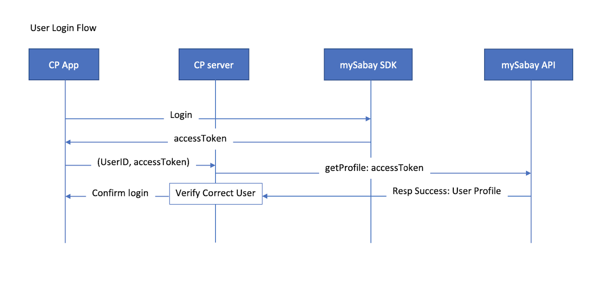
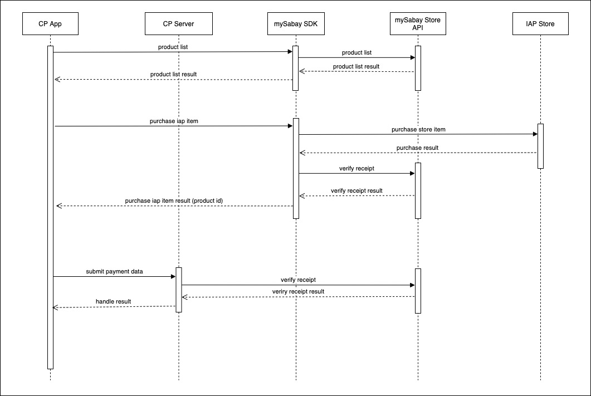
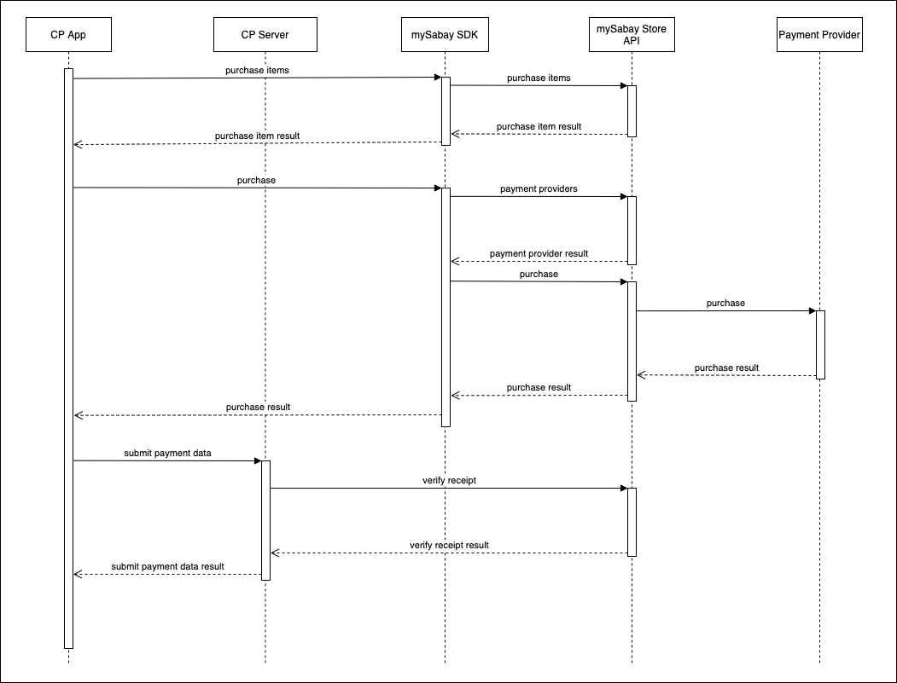

# Official MySabay SDK for iOS

This is the official MySabay SDK for native iOS application. To use this SDK, you can follow the guides below or download the test with the example project we have in this repository.

## Create your application

Create your MySabay application if you don't have one yet at [MySabay App Dashboard](https://kh.mysabay.com:8443/index.html) and copy your `appId`
and `appSecret` for the integration.

## Workflow

### Login flow



### Payment flow

There are 2 different payment flows in the SDK: 1). payment with Apple In App Purchase 2). payment with mySabay Wallet which includes different payment options such as Telco, Sabay Coin, and the list will continue as we are working to add more payment service providers such as banks. You will have to implement the SDK payment following the 2 flows below

#### 1). Payment with In-App Purchase:



#### 2). Payment with mySabay Wallet:



Refer to the API document below for payment receipt validation of both payments.

## MySabaySDK Sample App

This repo contains a sample app which uses MySabaySDK. To run the sample app, make sure you have a stable version of XCode installed on your machine. Then do the followings:

1. Open XCode
2. Click `Open another project...`
3. Navigate to the project folder and go into `MySabaySDKSampleApp`
4. Select `MySabaySDKSampleApp.xcodeproj` file and click `Open`
5. Once the project is open, select a simulator or generic device you wish to run the app.
6. Click on the Play button (`Build then run the current scheme`)

## Installation

The SDK is published on Cocoapods, so you can simply install into your project with pod or you can also download and manually install at [MySabay SDK](https://github.com/sabay-digital/app.ios.sdk.mysabay.com.public/raw/master/MySabaySdk.zip)

Add the following line to your `Podfile`
```bash
pod 'MySabaySdk'
```

If you don't have a Podfile, you can first initialize it.
```bash
$ pod init
```

Open the `Podfile` and you would see something like this.
```
platform :ios, '8.0'
use_frameworks!

target 'MyApp' do
    // Add pod 'MySabaySdk' to this line
end
```

Then you can simply run
```bash
$ pod install
```

## Configuration

Next, it is time to config your Xcode project to update Info.plist, AppDelegate and SceneDelegate.

**Info.plist**

> Add the following contents to your Info.plist file

```xml
<key>MySabayAppId</key>
<string>{appId}</string>
<key>MySabayAppName</key>
<string>{appName}</string>
<key>MySabayAppSecret</key>
<string>{appSecret}</string>
```

```xml
<key>CFBundleURLTypes</key>
<array>
    <dict>
        <key>CFBundleTypeRole</key>
	    <string>Viewer</string>
	    <key>CFBundleURLName</key>
	    <string>aog</string>
	    <key>CFBundleURLSchemes</key>
	    <array>
	        <string>mysabay{appId}</string>
	    </array>
	</dict>
</array>
```

Configuration

MSMySabaySDK has default configuration with dark theme and sandbox url.

```swift
let theme = MSTheme()
var appearence = MSAppearence()
appearence.title = "My Sample"
appearence.theme = theme
var configure = MSConfigure()
configure.sandBox = true
configure.appTheme = .dark
configure.appearence = appearence
MSMySabaySDK.configure(configure: configure)
```

or

```swift
MSMySabaySDK.configure()
```

AppDelegate.swift

```swift
import MySabaySdk

func application(_ application: UIApplication, didFinishLaunchingWithOptions launchOptions: [UIApplication.LaunchOptionsKey: Any]?) -> Bool {
    MSMySabaySDK.configure()
    MSMySabaySDK.shared.addTransactionObserver()
    return true
}

func application(_ app: UIApplication, open url: URL, options: [UIApplication.OpenURLOptionsKey : Any] = [:]) -> Bool {
    return MSMySabaySDK.shared.handleOpenUrl(url: url)
}

func applicationWillTerminate(_ application: UIApplication) {
    MSMySabaySDK.shared.removeTransactionObserver()
}
```

**SceneDelegate.swift**

```swift
import MySabaySdk

func scene(_ scene: UIScene, openURLContexts URLContexts: Set<UIOpenURLContext>) {
    MSMySabaySDK.shared.handleOpenUrl(contexts: URLContexts)
}
```

## Integration

> Note that in order to use the store and checkout function, the user must login first.
> Follow the guide below for each functions provided by the SDK:

- **Login**

```swift
import MySabaySdk

MSMySabaySDK.shared.logIn { result in
    switch result {
        case .loginSuccess(let refreshToken, let accessToken):
            print("RefreshToken: \(refreshToken.tokenString!)")
            print("AccessToken: \(accessToken.tokenString!)")
            print("AccessToen Expire: \(accessToken.expirationTime!)")
            break
        case .loginFailed(let error):
            print(error.localizedDescription)
            break
    }
}
```

- **Store and checkout**

```swift
import MySabaySdk

MSMySabaySDK.shared.openStore { result in
    switch result {
        case .purchaseApple(let product, let receiptData):
            print("Product: \(product.productIdentifier)")
            print("ReceiptData: \(receiptData)")
            break
        case .purchaseMySabay(let purchase):
            print("Hash: \(purchase.hash!)")
            print("Amount: \(purchase.amount!)")
            print("AssetCode: \(purchase.assetCode!)")
            print("PackageId: \(purchase.packageId!)")
            print("Bonus: \(purchase.bonus!)")
            break
        case .purchaseFailed(let error):
            print("\(error.localizedDescription)")
            break
    }
}
```

- **Get profile**

```swift
import MySabaySdk

MSMySabaySDK.shared.getUserProfile()
    .then { profile in
        print("Profile uuid: \(profile.uuid!)")
        print("Profile mySabayUserId: \(profile.mySabayUserId!)")
        print("Profile serviceId: \(profile.serviceId!)")
        print("Profile serviceUserId: \(profile.serviceUserId!)")
        print("Profile lastLogin: \(profile.lastLogin!)")
        print("Profile status: \(profile.status!)")
        print("Profile createdAt: \(profile.createdAt!)")
        print("Profile updatedAt: \(profile.updatedAt!)")
        print("Profile enableLocalPay: \(profile.enableLocalPay!)")
        print("Profile balance \(profile.balance.coin!)SC \(profile.balance.gold!)SG")
    }
    .catch { error in
        print(error.localizedDescription)
    }
```

- **Refresh token**

```swift
import MySabaySdk

MSMySabaySDK.shared.refreshTokens()
    .then { (refreshToken, accessToken) in
        print("RefreshToken: \(refreshToken.tokenString!)")
        print("AccessToken: \(accessToken.tokenString!)")
        print("AccessToen Expire: \(accessToken.expirationTime!)")
    }
    .catch { error in
        print(error.localizedDescription)
    }
```

- **Verify token with server**

```swift
import MySabaySdk

MSMySabaySDK.shared.verifyToken()
    .then { status in
        print("Valid: \(status)")
    }
    .catch { error in
        print(error.localizedDescription)
    }
```

- **Logout**

```swift
import MySabaySdk

MSMySabaySDK.shared.logout(all: false) { result in
    switch result {
        case .logoutSuccess(let message):
            print("\(message)")
            break
        case .logoutFailed(let error):
            print("\(error.localizedDescription)")
            break
    }
}
```

- **Check valid token locally**

```swift
if MSAccessToken.isValid {}
if MSRefreshToken.isValid {}
```

- **Get current token**

```swift
if let accessToken = MSAccessToken.currentToken {}
if let refreshToken = MSRefreshToken.currentToken {}
```

- **Checking Session**
  
The app that uses MySabay SDK does not need to check if the session exist. The App calls the SDK's login everytime the it starts. The SDK then checks if the session exist, if the session doesn't exist the SDK opens the login page for the user to login to a new session.

The SDK also uses `MSAccessToken.isValid {}` to validate the token and `MSAccessToken.currentToken {}` to get the current token if it's valid.

## MySabay API

### Server side validation

- In order for the CP server to validate the user access token received from the client as valid, mySabay also hosts pulic user api for fetching user profile and validating token. The API document is available [here](https://api-reference.mysabay.com/).

- In order for the CP server to validate the payment receipt from In-App Purchase or mySabay wallet, mySabay also hosts public store api available [here](https://api-reference.mysabay.com/?urls.primaryName=mySabay%20SDK%20-%20Store%20API).
